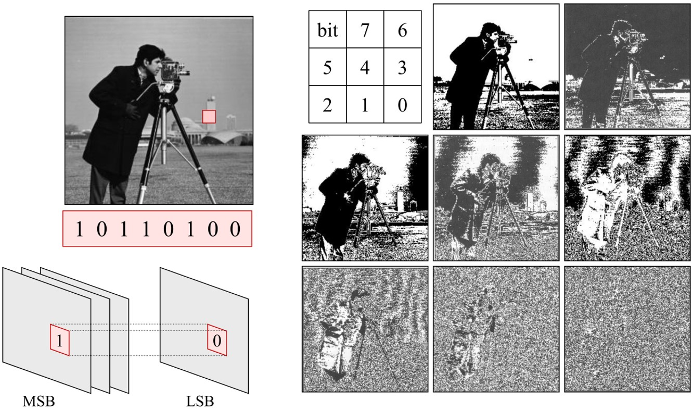

# DIP 07010667 Assignment 2: Bit-Plane Slicing

**Due: 11:59 pm, November 13, 2020**

Welcome to the second assignment of this course! The objective of the Assignment 2 is to 

1. Understand how to read and show an image.
2. Understand the structure of digital image.
3. Implement a simple image processing algorithm by Numpy.
4. Get familiar with OpenCV.

The following figure demonstrates the structure of assignment 2. Given a gray image, dividing it into eight 1-bit planes to highlight the contribution made to total image appearance by specific bits.

## Step 1: Setup your environment

Use Pycharm as python editior. You need to prepare such packages:

1. Anaconda
2. OpenCV

## Step 2: Finish the script

Make sure your code can be run completely bug-free. Our staff will run the codes, so make sure nothing stop the running.

## Step 3: Submit your work

Following the procedure to submit your work:

1. Before submitting, remember to fill your **name and student ID** into the table at the top of the file.
5. Send the **script file** via email: [dip_course@126.com](mailto:dip_course@126.com) with title in pattern `"DIP07010667-hw2-{name}-{id}-2020autumn".format(name="john", id="123456")` for instance: `DIP07010667-hw2-john-123456-2020autumn` 

------

*2020-2021 1st term, DIP 07010667 : Digital Image Processing. International Exchange Center, Weifang University of Science and Technology. Course Instructor: Guoxu Liu.