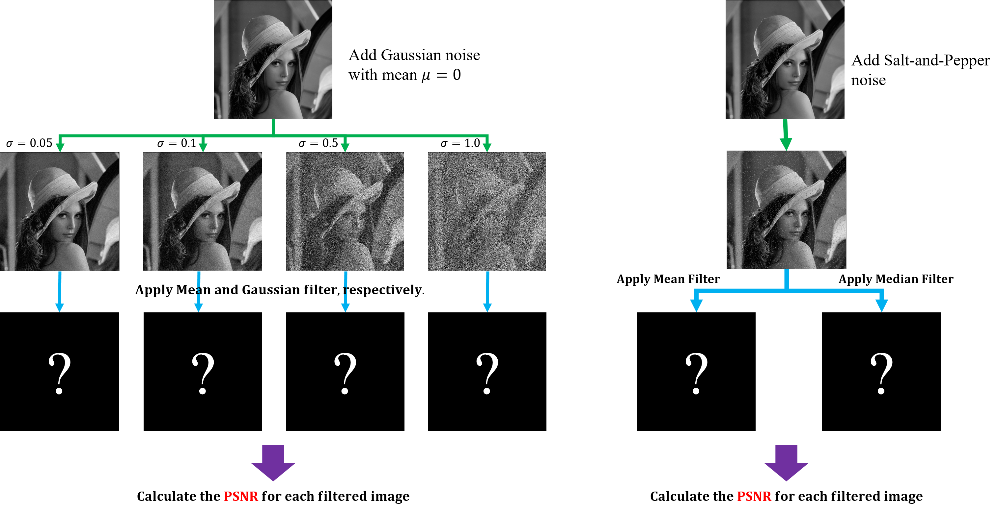

# DIP 07010667 Assignment 3: Noise Removal

**Due: 11:59 pm, December 6th, 2020**

Welcome to the third assignment of this course! The objective of the Assignment 3 is to 

1. Understand what is gaussian white noise and salt-and-pepper noise.
2. Understand how to deal with the above two types of noise.
4. Get more familiar with OpenCV. 

The following figure demonstrates the structure of assignment 3. Given a gray image, add each type of the noises to it, then apply different filters to the contaminated image to reduce the noise as much as you can. Finally, use the Peak Signal-to-Noise (PSNR) metric to evaluate your noise removal effect. The requirement is as follows:

1. Add Gaussian noise to the original image with mean $\mu$=0, standard deviation $\sigma$=0.05, 0.1, 0.5, 1.0. 

2. Add Salt-and-Pepper noise to the original image.

3. Apply mean filter and gaussian filter to the contaminated image by Gaussian noise.

4. Apply median filter to the image contaminated by Salt-and-Pepper noise.

5. Calculate PSNR of the filtered image to see the noise removal effect.

   

* **Noting**: the specific value of the mean and gaussian filters are specified by yourself.

* If you could **implement the filtering process by yourself** instead of using the opencv library function, you will be **awarded extra scores**.

* The expression for PSNR is:
  $$
  PSNR=10 \cdot log10(\frac{MAX^2}{MSE})=20\cdot log10(\frac{MAX}{\sqrt{MSE}})
  $$
  where
  $$
  MSE=\frac{1}{M\cdot N}\sum^{M-1}_{x=0}\sum^{N-1}_{y=0}||filtered_image(x,y)-clean_image(x,y||^2 \\
  $$

  $$
  MAX = 255
  $$

  

## Step 1: Setup your environment

Use Pycharm as python editior. You maybe need to prepare such packages:

1. Anaconda
2. OpenCV
3. Numpy
4. Matplotlib.pyplot

## Step 2: Finish the script

Make sure your code can be run completely bug-free. Our staff will run the codes, so make sure nothing stop the running.

## Step 3: Submit your work

Following the procedure to submit your work:

1. Before submitting, remember to fill your **name and student ID** into the table at the top of the file.
5. Send the **script file** via email: [dip_course@126.com](mailto:dip_course@126.com) with title in pattern `"DIP07010667-hw3-{name}-{id}-2020autumn".format(name="john", id="123456")` for instance: `DIP07010667-hw3-john-123456-2020autumn` 
3. This assignment will be implemented by each student instead of a group.

------

*2020-2021 1st term, DIP 07010667 : Digital Image Processing. International Exchange Center, Weifang University of Science and Technology. Course Instructor: Guoxu Liu.